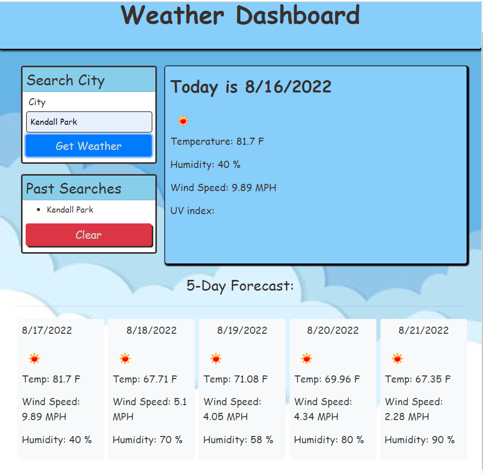

# Search-Weather-API

## Table of Contents
  - [User Story](#user-story)
  - [Project Description](#project-description)
  - [Screenshot-of-Application](#screenshot-of-application)
  - [Deployed URL Link](#deployed-url-link)
  - [Created By](#created-by)

## User Story

```md
AS A user wants to check the weather and five-day forecast
I WANT a quick way to generate weather for any city searched
```

## Project Description
---

```md
When you want to check the current weather and five-day forecast
THEN I am presented with current and five-day forecast for that city and that city is added to local storage
WHEN I view current weather conditions for that city
THEN I am presented with the city name, the date, an icon representation of weather conditions, the temperature, the humidity, the wind speed, and the UV index
WHEN I view the UV index
THEN I am presented with a color that shows the severity of that cities UV index
WHEN I view the five-day forecast for that city
THEN I am presented with a the date, an icon representation of weather conditions, the temperature, the wind speed, and the humidity
WHEN I click on a city in the search history/local storage
THEN I that cities conditions are presented again
```

## Screenshot of Application
---


## Deployed URL Link
---

https://dmerk2.github.io/Weather-Dashboard/

## Created By
---

Click to view <a href="https://github.com/dmerk2">Daniel Merkin's</a> Github.

```md
© 2022 Daniel Merkin
```
